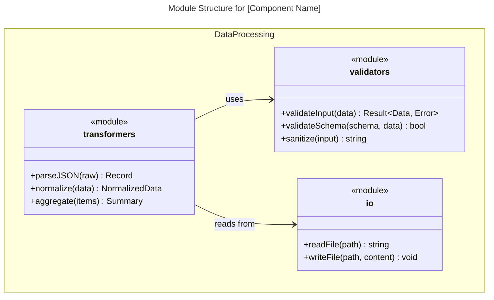
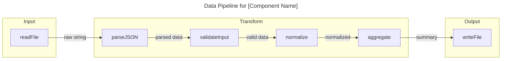
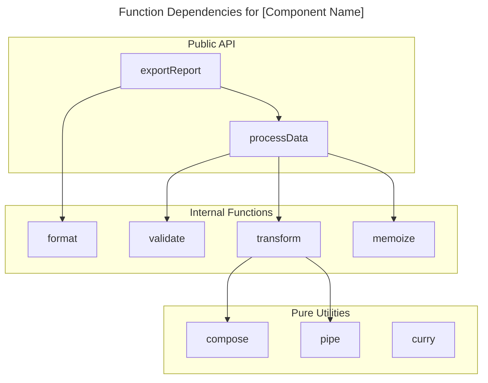

# Functional/Procedural Code (Modules, Functions)

For functional or procedural code, you have two options:

**Option A: Module Structure Diagram** - Use `classDiagram` to show modules and their exported functions:

**Option B: Data Flow Diagram** - Use `flowchart` to show function pipelines and data transformations:

**Option C: Function Dependency Graph** - Use `flowchart` to show which functions call which:

