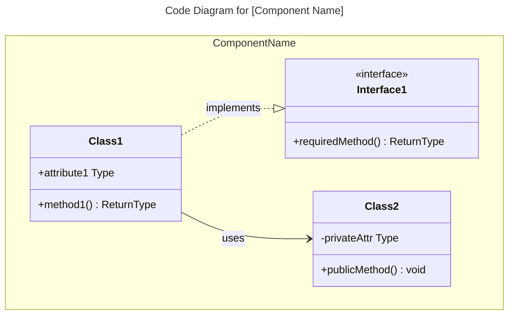

# Object-Oriented Code (Classes, Interfaces)

Use `classDiagram` for OOP code with classes, interfaces, and inheritance:


```mermaid
---
title: Code Diagram for [Component Name]
---
classDiagram
    namespace ComponentName {
        class Class1 {
            +attribute1 Type
            +method1() ReturnType
        }
        class Class2 {
            -privateAttr Type
            +publicMethod() void
        }
        class Interface1 {
            <<interface>>
            +requiredMethod() ReturnType
        }
    }

    Class1 ..|> Interface1 : implements
    Class1 --> Class2 : uses
```
````