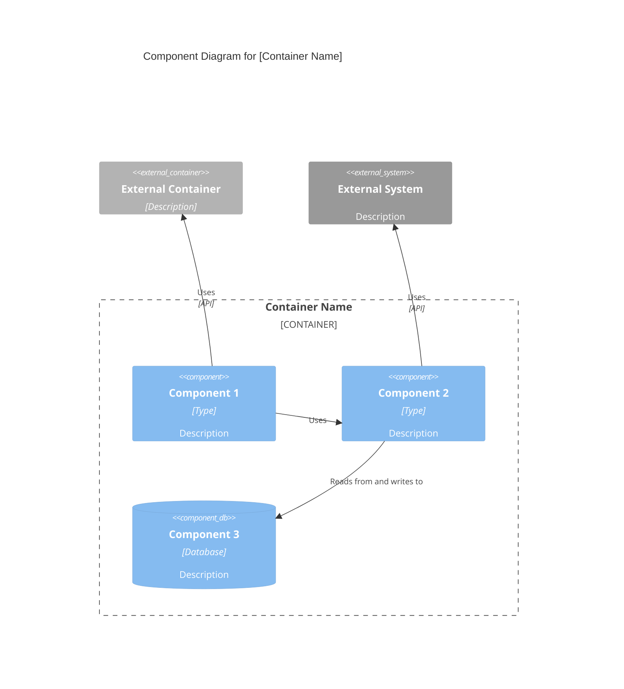

# External Systems

- [External System]: [How it's used]

## Component Diagram

Use proper Mermaid C4Component syntax. Component diagrams show components **within a single container**:


````

**Key Principles** (from [c4model.com](https://c4model.com/diagrams/component)):

- Show components **within a single container** (zoom into one container)
- Focus on **logical components** and their responsibilities
- Show **component interfaces** (what they expose)
- Show how components **interact** with each other
- Include **external dependencies** (other containers, external systems)

````

## Master Component Index Template

```markdown
# C4 Component Level: System Overview

## System Components