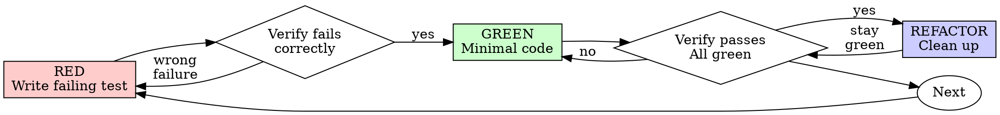

# Test-Driven Development (TDD)

## Overview

Write the test first. Watch it fail. Write minimal code to pass.

**Core principle:** If you didn't watch the test fail, you don't know if it tests the right thing.

**Violating the letter of the rules is violating the spirit of the rules.**

## When to Use

**Always:**
- New features
- Bug fixes
- Refactoring
- Behavior changes

**Exceptions (ask your human partner):**
- Throwaway prototypes
- Generated code
- Configuration files

Thinking "skip TDD just this once"? Stop. That's rationalization.

## The Iron Law

```
NO PRODUCTION CODE WITHOUT A FAILING TEST FIRST
```

Write code before the test? Delete it. Start over.

**No exceptions:**
- Don't keep it as "reference"
- Don't "adapt" it while writing tests
- Don't look at it
- Delete means delete

Implement fresh from tests. Period.

## Red-Green-Refactor



## 🧠 Knowledge Modules (Fractal Skills)

### 1. [RED - Write Failing Test](./sub-skills/red-write-failing-test.md)
### 2. [Verify RED - Watch It Fail](./sub-skills/verify-red-watch-it-fail.md)
### 3. [GREEN - Minimal Code](./sub-skills/green-minimal-code.md)
### 4. [Verify GREEN - Watch It Pass](./sub-skills/verify-green-watch-it-pass.md)
### 5. [REFACTOR - Clean Up](./sub-skills/refactor-clean-up.md)
### 6. [Repeat](./sub-skills/repeat.md)
